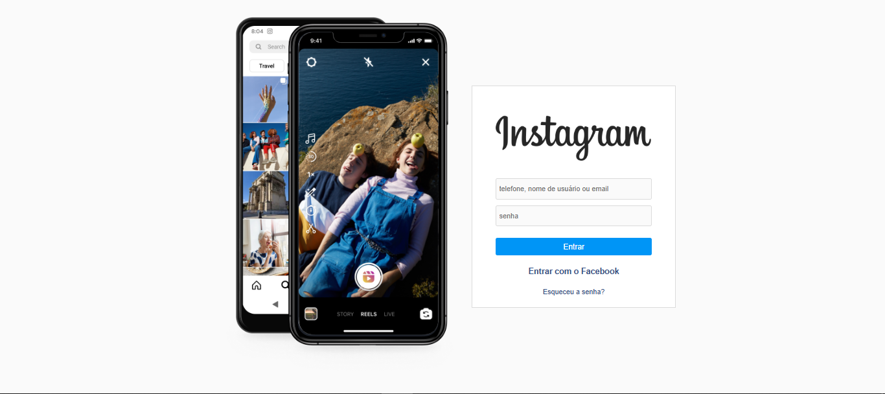

# 📸 Instagram Clone

Clone da interface do Instagram, desenvolvido com foco em praticar habilidades de front-end e recriar a aparência da rede social com HTML, CSS e JavaScript.

## 🧩 Funcionalidades

- Layout inspirado na interface antiga do Instagram
- Estrutura responsiva para desktop e dispositivos móveis
- Navegação simulada entre abas (explorar, notificações, perfil)

## 🛠️ Tecnologias utilizadas

- HTML5  
- CSS3  
- JavaScript

## 📷 Prévia

 <!-- Substitua pelo nome real da imagem se houver -->

## 🚀 Como usar

1. Clone o repositório:
   ```bash
   git clone https://github.com/GabrielAlderige/Instagram-clone.git
   ```

2. Acesse a pasta do projeto:
   ```bash
   cd Instagram-clone
   ```

3. Abra o `index.html` no navegador:
   - Clique duas vezes no arquivo `index.html`  
   - Ou utilize uma extensão como o Live Server no VSCode

## 🎯 Objetivo

Este projeto tem fins educacionais e foi criado com o objetivo de reforçar conhecimentos de front-end, explorando estilos modernos e boas práticas de layout.

## 📄 Licença

Este projeto está sob a licença MIT. Veja o arquivo [LICENSE](LICENSE) para mais detalhes.

---

Feito por [Gabriel Alderige](https://github.com/GabrielAlderige)  
📷 Instagram: [@gabrielalderige](https://instagram.com/gabrielalderige)  
💬 WhatsApp: [Clique aqui para conversar](https://wa.me/5535998416972)
